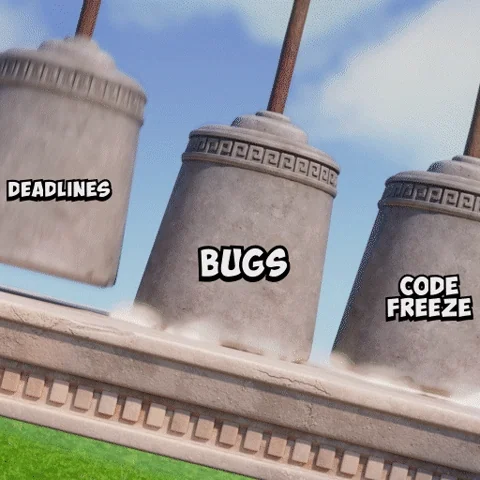

# Titulo

<details open="open">
<summary>Table of Contents</summary>

- [About](#about)
  - [Built With](#built-with)
- [Getting Started](#getting-started)
  - [Prerequisites](#prerequisites)
  - [Usage](#usage)
    - [Cookiecutter template](#cookiecutter-template)
    - [Manual setup](#manual-setup)
    - [Variables reference](#variables-reference)
- [Roadmap](#roadmap)
- [Contributing](#contributing)
- [Support](#support)
- [License](#license)
- [Acknowledgements](#acknowledgements)

</details>

## Etiquetas

Adicione etiquetas de algum lugar, como: [shields.io](https://shields.io/) ou [dev.to](https://dev.to/envoy_/150-badges-for-github-pnk)

[](https://choosealicense.com/licenses/mit/)
[](https://opensource.org/licenses/)
[](http://www.gnu.org/licenses/agpl-3.0)

## Descrição

O que faz o app
Com oq Construido
Por que?

## Roadmap

- [x] Funcionalidade 1
- [ ] Funcionalidade 2
- [ ] Funcionalidade 3

## Stack utilizada

**Front-end:** React, Redux, TailwindCSS

**Back-end:** Node, Express

## instrução de instalação

### Pre requisitos

### Etapas

Instale my-project com npm

```bash
  npm install my-project
  cd my-project
```

## instrução de uso

- Abra localhost:3000
- faça Login

## Uso/Exemplos

```javascript
import Component from "my-project";

function App() {
  return <Component />;
}
```

## Exemplo de Código de API

Aqui está um exemplo de como fazer uma requisição para a API:

```javascript
// Importando a biblioteca axios
const axios = require("axios");

// URL da API
const url = "https://api.exemplo.com/dados";

// Função para obter dados da API
async function getData() {
  try {
    const response = await axios.get(url);
    console.log(response.data);
  } catch (error) {
    console.error("Erro ao obter dados da API:", error);
  }
}

// Chamando a função
getData();
```

## Documentação de em tabela

| Cor         | Hexadecimal                                                      |
| ----------- | ---------------------------------------------------------------- |
| Cor exemplo |  #0a192f |
| Cor exemplo |  #f8f8f8 |
| Cor exemplo |  #00b48a |
| Cor exemplo |  #00d1a0 |

## Autores

- [@octokatherine](https://www.github.com/octokatherine)

## Contribuidores ou Owner(donos)

reconhecimento




## Contribuição

Contribuições são sempre bem-vindas! Veja o arquivo `CONTRIBUTING.md` para mais detalhes sobre o nosso código de conduta e o processo de envio de pull requests.

## Licença

- [x] Permissão pra uso comercialmente
- [x] Olhar se inspirar
- [x] Educacional e não comercional

## Referência

- [Awesome Readme Templates](https://awesomeopensource.com/project/elangosundar/awesome-README-templates)
- [Awesome README](https://github.com/matiassingers/awesome-readme)
- [How to write a Good readme](https://bulldogjob.com/news/449-how-to-write-a-good-readme-for-your-github-project)

# Outras Adições

| Name                       | Default value      | Description                                                                 |
| -------------------------- | ------------------ | --------------------------------------------------------------------------- |
| PROJECT_NAME               | My Amazing Project | Your project name                                                           |
| REPO_SLUG                  | my-amazing-project | Repo slug must match the GitHub repo URL slug part                          |
| GITHUB_USERNAME            | dec0dOS            | Your GitHub username **without @**                                          |
| FULL_NAME                  | Alexey Potapov     | Your full name                                                              |
| OPEN_SOURCE_LICENSE        | MIT license        | Full OSS license name                                                       |
| modern_header              | y                  | Use HTML to prettify your header                                            |
| table_in_about             | n                  | Use table to wrap around About section                                      |
| include_logo               | y                  | Include Logo section. Only valid when `modern_header == y`                  |
| include_badges             | y                  | Include section for badges                                                  |
| include_toc                | y                  | Include Table of Contents                                                   |
| include_screenshots        | y                  | Include Screenshots section                                                 |
| include_project_assistance | y                  | Include Project assistance section                                          |
| include_authors            | y                  | Include Authors & contributors section                                      |
| include_security           | y                  | Include Security section and SECURITY.md file                               |
| include_acknowledgements   | y                  | Include Acknowledgements section                                            |
| include_code_of_conduct    | y                  | Include CODE_OF_CONDUCT.md file                                             |
| include_workflows          | y                  | Include .github/workflows directory                                         |
| use_codeql                 | y                  | Use [CodeQL](https://securitylab.github.com/tools/codeql/)                  |
| use_conventional_commits   | y                  | Add [Conventional Commits](https://www.conventionalcommits.org) notice      |
| use_github_discussions     | n                  | Use [GitHub Discussions](https://docs.github.com/en/discussions/quickstart) |

## Adicionar GIF


ou usa html mesmo tbm;


